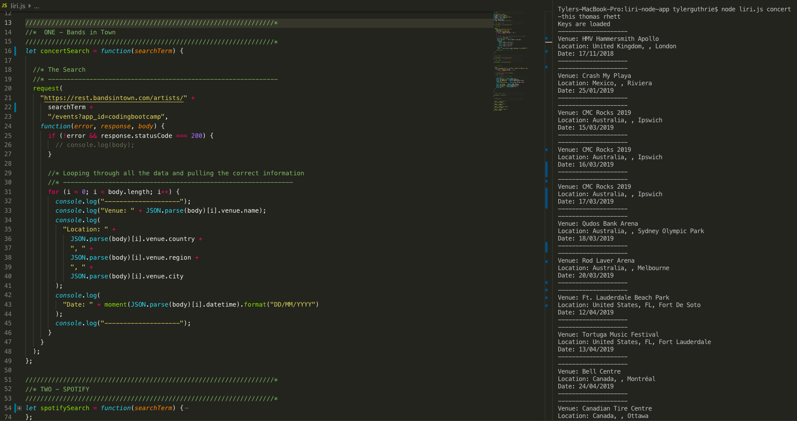
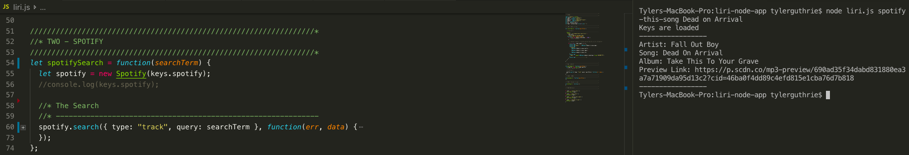
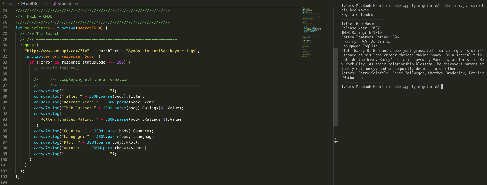
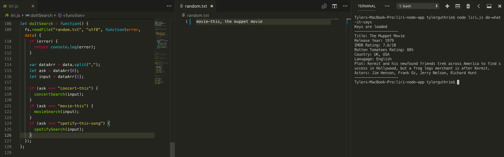

# liri-node-app

Language Interpretation and Recognition Interface.
Using the command line, the app will help execute several specified commands. Additional Details below. 

Commands
-----
- concert-this : searches the BandsinTown API for an upcoming concert. The search term must be an artist. This command will tell you where the artist's next shows are and when. 
  - Example (terminal): node liri.js concert-this <artist/band name here>
 

- spotify-this-song : searches the Spotify API for information about a particular track specificed in the CLI. The search term must be a song name. The most popular Artist's song with that song title will populate along with the album the song is featured and a preview link of the song.
  - Example (terminal): node liri.js spotify-this-song <song name here> 
 
  
- movie-this : searches the OMDB API for information about a particular movie. The search term must be a movie title. The following movie's Release Year & IMDB Rating are provided. 
  - Example (terminal): node liri.js movie-this <movie name here>
 

- do-what-it-says : runs the command specified in the random.txt file.
  - Example (terminal): node liri do-what-it-says  
 

Technology Used
-----
- Javascript
- BandsinTown API
- Spotify API
- OMDB API

Concert-this Example:
-----

Spotify-this-song Example:
-----

Movie-this Example:
------

Do-what-it-says Example:
-----

